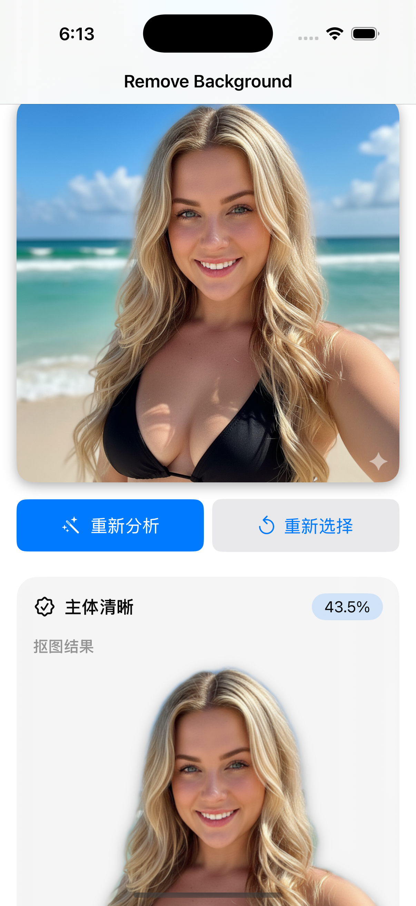
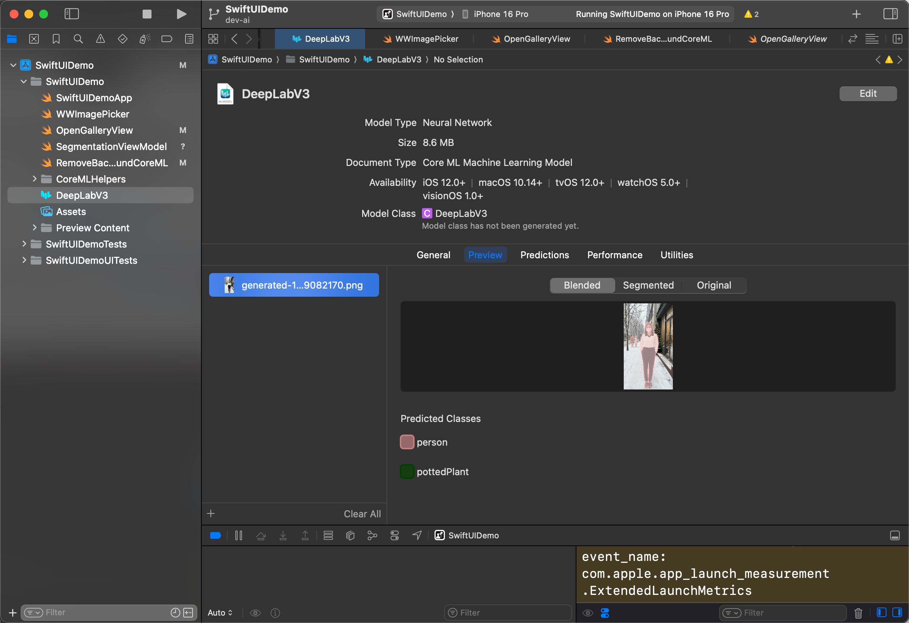

# RemoveBackgroundWithCoreML 🇺🇸
SwiftUI + Core ML playground that removes backgrounds and switches its UI outfit based on segmentation vibes. The whole experience is meant to feel like a tiny creative tool rather than a lab report.

<video src="demo.mp4" controls loop muted playsinline width="600"></video>

---

## Action shots
- **UI Snapshot**  
  
- **Xcode Peek**  
  

## Why it’s fun
- DeepLabV3 segmentation + Core Image gives cutouts and dreamy blurred backgrounds without leaving Swift.
- `SegmentationResult` bundles mask preview, coverage %, and a quality label so SwiftUI knows how to react.
- `AdaptiveSegmentationView` leans on `ViewThatFits`; it reshuffles cards if the subject is too big, missing, or just right.
- A Core ML helper toolbox ships with the repo—pixel buffers, CIImage tricks, MLMultiArray conversions, the works.

## Map of the land
```
.
├── SwiftUIDemo/
│   ├── SwiftUIDemoApp.swift
│   ├── OpenGalleryView.swift
│   ├── SegmentationViewModel.swift
│   ├── RemoveBackgroundCoreML.swift
│   └── CoreMLHelpers/
├── SwiftUIDemoTests/
├── SwiftUIDemoUITests/
├── demo.mp4
├── demo.png
└── DeepLabV3-in-xcode.png
```

## Build it
1. Fire up the project:
   ```bash
   xed SwiftUIDemo.xcodeproj
   ```
2. Pick the `SwiftUIDemo` scheme, target any simulator (iPhone 16 if you want to match screenshots), hit Run.
3. Command-line build:
   ```bash
   xcodebuild -scheme SwiftUIDemo -destination 'platform=iOS Simulator,name=iPhone 16' build
   ```
4. Tests, because science:
   ```bash
   xcodebuild -scheme SwiftUIDemo -destination 'platform=iOS Simulator,name=iPhone 16' test
   ```

## Flow
1. `WWImagePicker` brings in a photo from the gallery.
2. `SegmentationViewModel` calls `UIImage.segmentForeground()` and unwraps a `SegmentationResult`.
3. Depending on `SegmentationQuality`, the UI either celebrates, suggests a retake, or gently shrugs.

## Where to go next
- Tune coverage thresholds or mix in additional mask metrics to be smarter about “good enough”.
- Write targeted XCTest/UITest cases for each state so nobody regresses the adaptive layout.
- Add fun extras: share sheets, multi-background previews, batch processing, or PNG export.

Got ideas? Open an issue and let’s keep the playground fun.*** End Patch to=functions.apply_patch ахь Need actual patch textual string with begin patch etc. above we used apply patch with json? yes we need send as string use? currently we provided as JSON due autop? In instructions for apply patch they require freeform string with patch grammar. We incorrectly provided JSON? I inserted "commentary to=functions.apply_patch  { }" but we saw ???. Need to reapply properly. previous call might not executed? Wait tool responded? no. need to call apply patch with patch string. let's do again. Continuous? We'll add file and patch. Maybe previous command not executed due error? log shows no output? last call nothing? yes because tool call not run due wrong format? show? there is no output indicates maybe not executed? we need confirm file existence. check ls? maybe not. We'll re-run to ensure. Use apply patch proper string. We'll create README.en and README.zh. Use patch file. Need to call apply patch with string. Dem instructions: apply patch tool expects direct string. use message with patch multi-line. Let's do again carefully. We'll include both file additions sequentially. Use patch for README.en first. Need to include begin patch etc. Let's do. 
